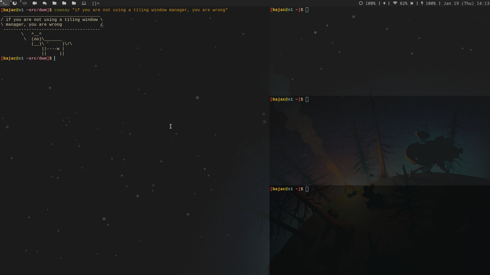

# DWM 



## Description

This is a fork of [dwm](https://dwm.suckless.org/)

The main change come from the workspace gestion. Each workspace is dedicated to a set of windows:
- workspace 1: terminals 
- workspace 2: browser (chrome, brave, ...)
- workspace 3: coding environement (vscode, intellij)
- workspace 4: video call (zoom)
- workspace 5: chat app (signal, telegram, discord)
- workspace 6, 7, 8: no use yet
- workspace 9: VMs

Controls are in `config.h`.

## Install

```bash
sudo make install
```


